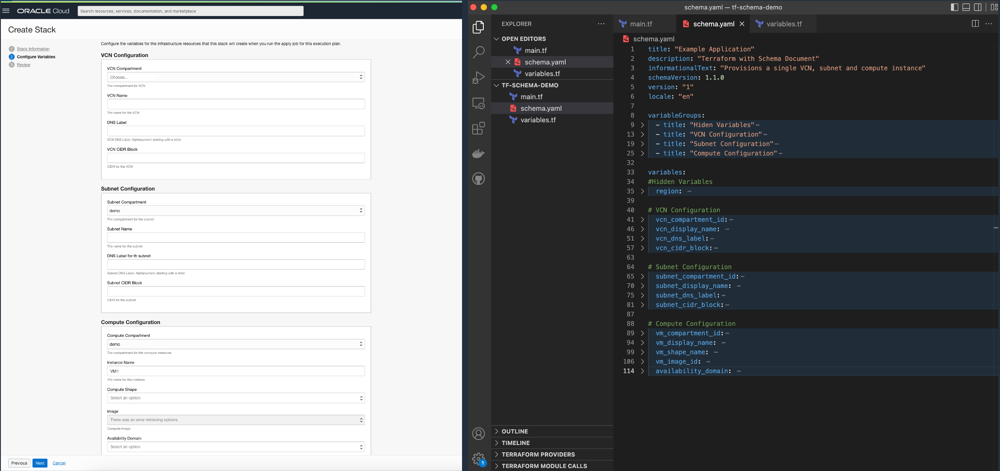

# schema_doc
Terraform with Schema Document - Provisioning template for a single VCN, subnet and compute instance

Terraform .tf files and schema to provide easy infrastructure deployment templates.

This sample code provisions a single VCN, subnet and compute instance using dropdowns with available resources.

Just create a resource manager stack, upload the code (from your local machine or github) fill in the variables and deploy!
